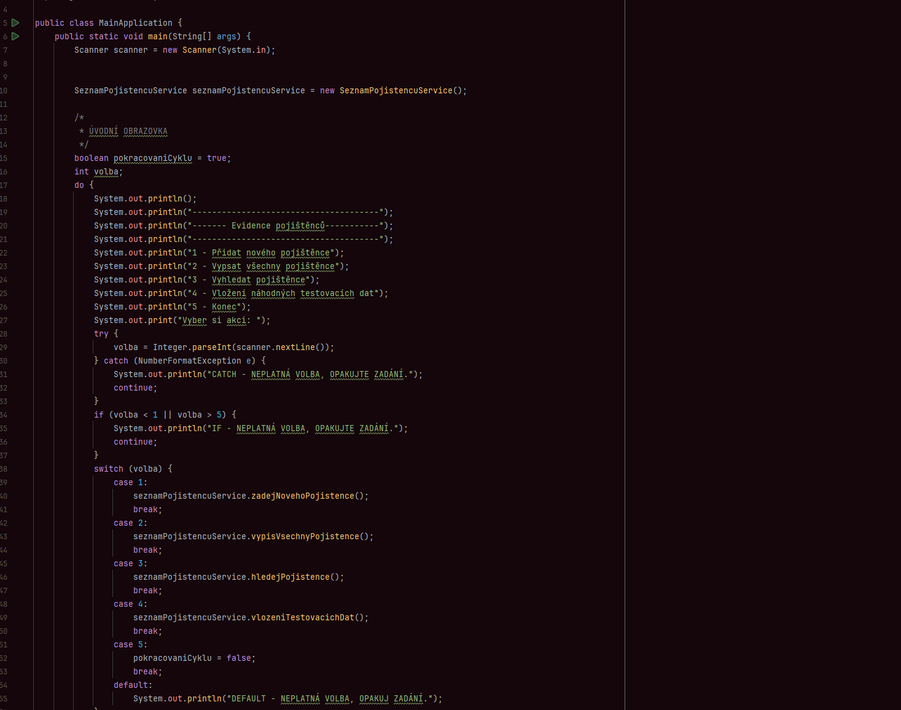
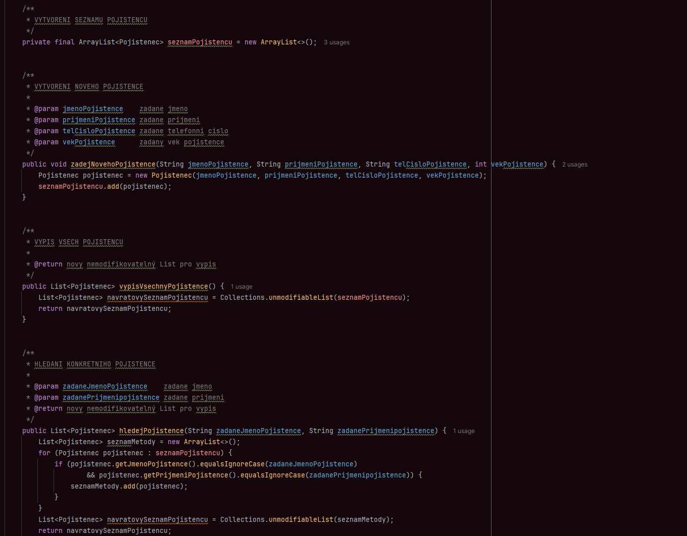
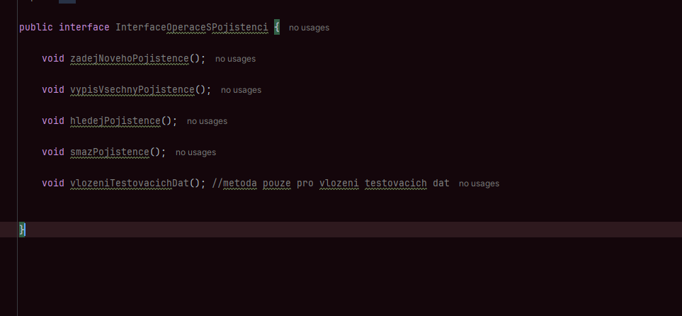
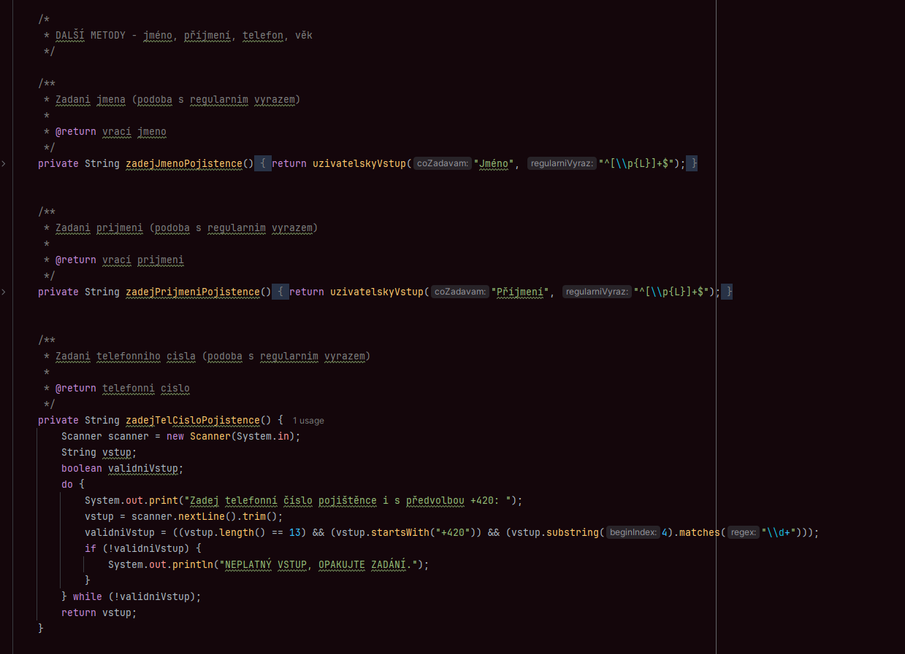
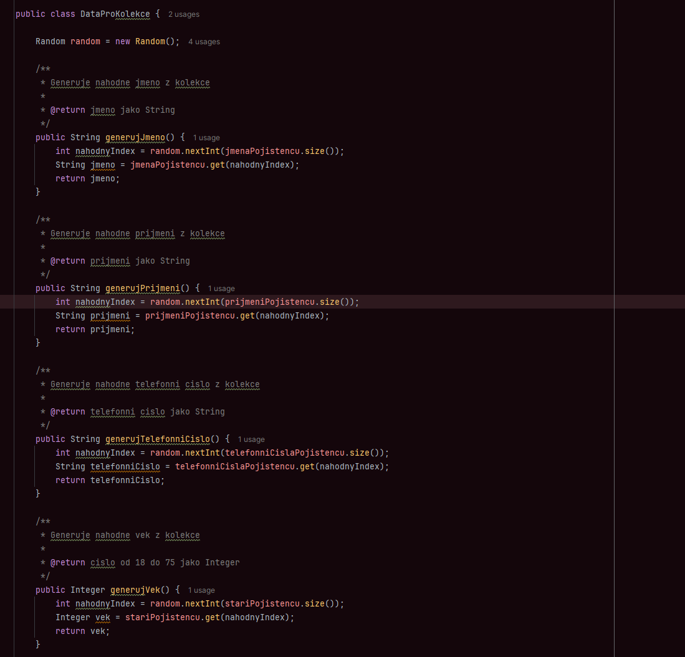

# ITNETWORK-JAVA-BASIC
Tento repozitář obsahuje  samostatný projekt, který byl vytvořeny jako součást kurzu na [ITnetwork](https://itnetwork.cz) se specifikací Java Basic (Tvorba www aplikací). 

## 📦 Projekt 

✅ Samostatný zakončující projekt založený na **Java OOP** a **kolekcích**. 

 
 
 
 
 
